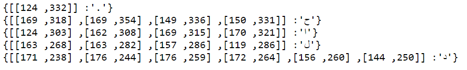

# Calliar
Calliar is a dataset for Arabic calligraphy. The dataset consists of 2500 json files that contain strokes manually annotated for Arabic calligraphy. 

## Stats 

| # of Samples | # of Words | # of Chars | # of Strokes | 
---------------|-----------|------------|---------------
Train | 2,000 | 6,065 | 24,722 | 36,561 
Valid | 250 | 738 | 2,946 | 4,410 
Test | 250 | 753 |3,052 | 4,601 

## Dataset Formats 
Mainly, we have two basic formats. 
## .json 

Each `.json` file contains a list of strokes. Each list is a dictionary of the stroke character and the list of points. Each composite character like `ت` is mapped into a list of primitive strokes i.e `..ٮ `. Refer to the paper and to `chars.py` for more details on the mapping. 



## .npz 

The compressed format of the dataset `dataset.npz` is only 8.6 MB and uses the Ramer-Douglas-Peucker Algorithm to decrease the number of points per stroke. The python library [rdp](https://github.com/fhirschmann/rdp) was used for such task. The `.npz` format follows the same approach as [QuickDraw](https://github.com/googlecreativelab/quickdraw-dataset). 

## Visualization 

The `vis.py` file contains a list of python methods for easily visualizing the dataset. Here are two examples for drawing a sample json file and creating an animation.  <a href="https://colab.research.google.com/github/ARBML/Calliar/blob/main/demo.ipynb">
    
    </a>

```python
import glob
import matplotlib.pyplot as plt 
import json 
from IPython.core.display import display, HTML, Video
from vis import *

## show an image of the strokes 
drawing = json.load(open(json_path))
print(get_annotation(json_path))
data = convert_3d(drawing)
draw_strokes(data, stroke_width = 2, crop = True)

## create an animation. 
create_animation(json_path)
Video("tmp/video.mp4")
```

## Samples 


## Animation


https://user-images.githubusercontent.com/15667714/122345708-d272bc00-cf50-11eb-8d2d-526b166f7cbc.mp4


https://user-images.githubusercontent.com/15667714/122354315-8c6e2600-cf59-11eb-90e6-47f8864439a5.mp4


https://user-images.githubusercontent.com/15667714/122345737-dacaf700-cf50-11eb-9e43-5a238c7446f7.mp4

https://user-images.githubusercontent.com/15667714/122345750-de5e7e00-cf50-11eb-8120-2c606f67d89b.mp4


