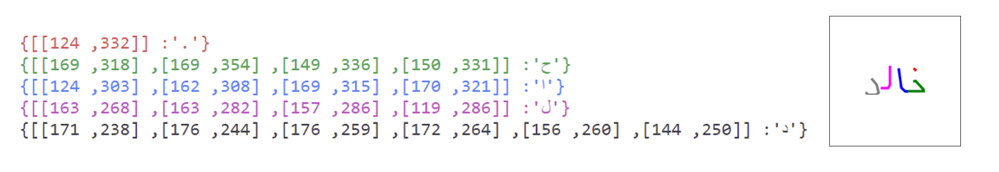
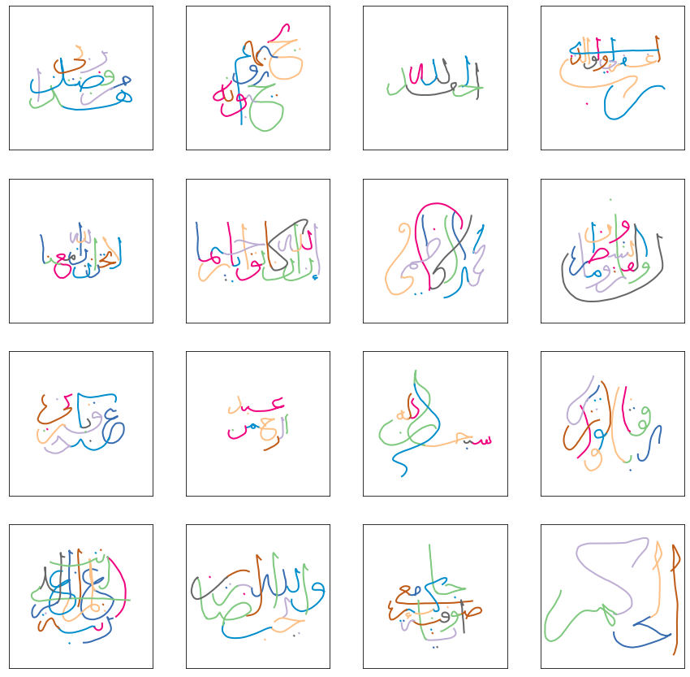
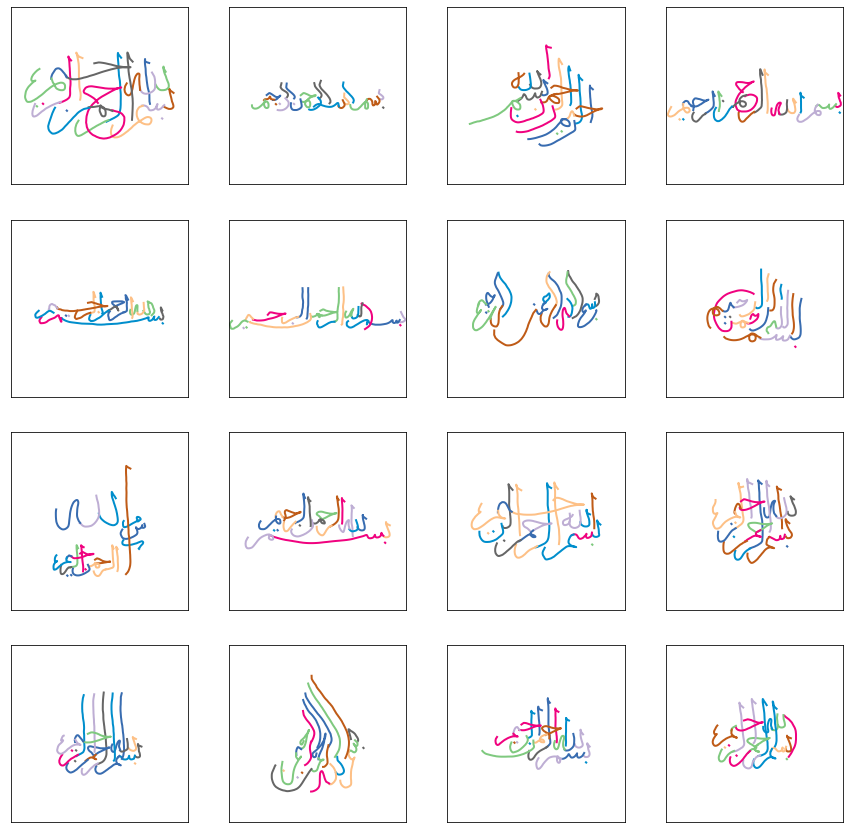

# Calliar
Calliar is a dataset for Arabic calligraphy. The dataset consists of 2500 json files that contain strokes manually annotated for Arabic calligraphy. This repository contains the dataset for the following paper : 

> **Calliar: An Online Handwritten Dataset for Arabic Calligraphy**<br>
> Zaid Alyafeai, Maged S. Al-shaibani, Mustafa Ghaleb, Yousif Ahmed Al-Wajih<br>
> https://arxiv.org/abs/2106.10745
>
> **Abstract:** *Calligraphy is an essential part of the Arabic heritage and culture. It has been used in the past for the decoration of houses and mosques. Usually, such calligraphy is designed manually by experts with aesthetic insights. In the past few years, there has been a considerable effort to digitize such type of art by either taking a photo of decorated buildings or drawing them using digital devices. The latter is considered an online form where the drawing is tracked by recording the apparatus movement, an electronic pen for instance, on a screen. In the literature, there are many offline datasets collected with a diversity of Arabic styles for calligraphy. However, there is no available online dataset for Arabic calligraphy. In this paper, we illustrate our approach for the collection and annotation of an online dataset for Arabic calligraphy called Calliar that consists of 2,500 sentences. Calliar is annotated for stroke, character, word and sentence level prediction.*

## Stats 

| # of Samples | # of Words | # of Chars | # of Strokes | 
---------------|-----------|------------|---------------
Train | 2,000 | 6,065 | 24,722 | 36,561 
Valid | 250 | 738 | 2,946 | 4,410 
Test | 250 | 753 |3,052 | 4,601 

## Dataset Formats 
Mainly, we have two basic formats. 
### .json 

Each `.json` file contains a list of strokes. Each list is a dictionary of the stroke character and the list of points. Each composite character like `ت` is mapped into a list of primitive strokes i.e `..ٮ `. Refer to the paper and to `chars.py` for more details on the mapping. 



### .npz 

The compressed format of the dataset `dataset.npz` is only 8.6 MB and uses the Ramer-Douglas-Peucker Algorithm to decrease the number of points per stroke. The python library [rdp](https://github.com/fhirschmann/rdp) was used for such task. The `.npz` format follows the same approach as [QuickDraw](https://github.com/googlecreativelab/quickdraw-dataset). 


## Visualization 

The `vis.py` file contains a list of python methods for easily visualizing the dataset. Here are two examples for drawing a sample json file and creating an animation.  <a href="https://colab.research.google.com/github/ARBML/Calliar/blob/main/demo.ipynb">
    
    </a>

```python
import glob
import matplotlib.pyplot as plt 
import json 
from IPython.core.display import display, HTML, Video
from vis import *

## show an image of the strokes 
drawing = json.load(open(json_path))
print(get_annotation(json_path))
data = convert_3d(drawing)
draw_strokes(data, stroke_width = 2, crop = True)

## create an animation. 
create_animation(json_path)
Video("tmp/video.mp4")
```

## Samples 




## Animation


https://user-images.githubusercontent.com/15667714/122690255-1acff980-d231-11eb-9752-730d8024041e.mp4


https://user-images.githubusercontent.com/15667714/122690258-1c012680-d231-11eb-98d0-4c89afd8aba3.mp4


https://user-images.githubusercontent.com/15667714/122690261-1d325380-d231-11eb-99ab-158455483561.mp4


https://user-images.githubusercontent.com/15667714/122690265-1efc1700-d231-11eb-9830-328725a82c11.mp4


## Citation 

```
@inproceedings{Alyafeai2021CalliarAO,
  title={Calliar: An Online Handwritten Dataset for Arabic Calligraphy},
  author={Zaid Alyafeai and Maged S. Al-shaibani and Mustafa Ghaleb and Yousif Ahmed Al-Wajih},
  year={2021}
}
```


